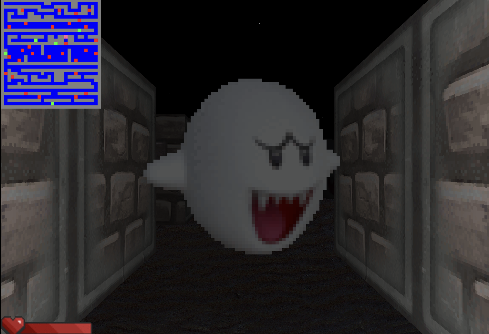

# cub3D

## Score

✅ 115 / 100 ✅
## Sujet

Ce projet est inspiré du jeu éponyme mondialement connu, considéré comme le premier FPS jamais développé : Wolfenstein 3D.
Il permet d'explorer la technique du ray-casting. 
L'objectif est de faire une vue dynamique au sein d'un labyrinthe, dans lequel vous devrez trouver votre chemin.



## Comment lancer

❗️ Fonctionne uniquement sur LINUX ❗️

Installer les librairies nécessaires pour faire tourner la MinilibX :
```
sudo apt-get update && sudo apt-get install xorg libxext-dev zlib1g-dev
```
Compiler et lancer le programme :
```
git clone https://github.com/sarahlesc/cub3D.git
cd cub3d
make
./cub3D map.cub
```

## Touches

W : avancer

S : reculer

A : gauche

D : droite

Q ou ← : regarder à gauche

E ou → : regarder à droite

↑ : accélérer

↓ : décélérer

ESPACE : rythme normal

## BONUS
- collision avec les murs
- texture sur le sol
- texture sur le plafond
- ombre basée sur la distance
- minimap
- barre de vie
- plus d'objets dans le labyrinthe (double sprite)
- collision avec les objets
- gain/perte de vie en touchant des sprites
- son et musique
- multi-touches
- accélérer/décélérer

## Sources
Parsing : https://github.com/mlaraki/cub3D_leaks_maps_tester

Raycasting : https://lodev.org/cgtutor/raycasting.html

Sprites : https://lodev.org/cgtutor/raycasting3.html

Site de textures : https://opengameart.org/
